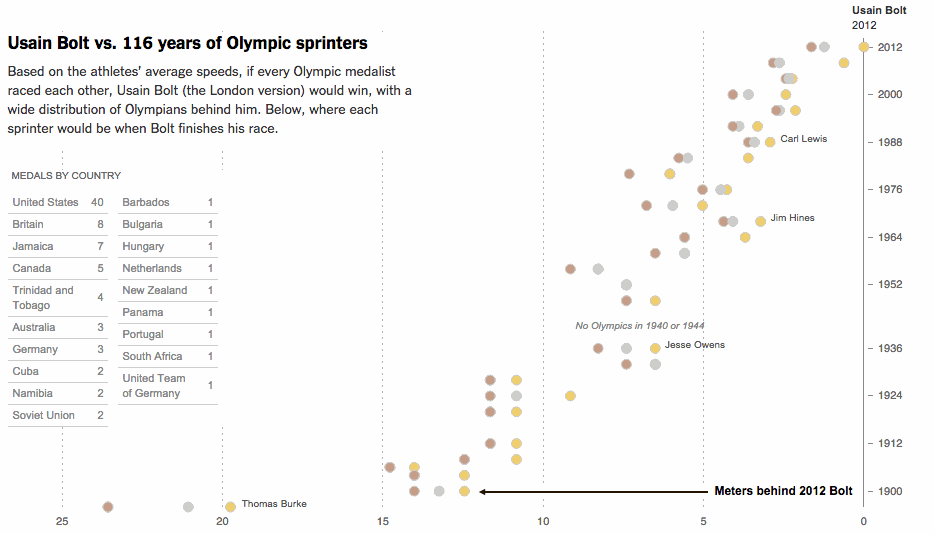

#Class 11: Interactivity; production-level details
Most of our examples so far have been proof-of concepts; in the next two classes we'll work toward making publication-quality charts, with the small touches that make all the difference. We'll also learn a couple more skills, including responsive designs with charts, Voronoi mouse overlays, a small amount of web development and preprocessing data with Node.js.

It will also be a good example in the most important tech skill that exists: learning how to to figure some things out on your own. (Don't worry, all the code will be posted eventually.)

##Lab
Here's an animation of the product you'll be creating in class in groups today. 



Your job is to make it, feature for feature. In addition, we'll want a few additional features:

  • responsiveness for mobile devices – when you resize your window, or, at least, refresh your page, the chart should render at the proper width

  • Buttons that toggle the view between meters behind 2012 Bolt and seconds behind 2012 bolt

  • improved mouse interaction using a [Voronoi tesselation](http://bl.ocks.org/mbostock/4060366).

  • possibly, a [node script](https://www.npmjs.com/package/d3) that pre-processes our data calculations, which may slightly speed up rendering.

You'll be working in groups, sort of like we did with our Barley farming exercise. List [here](https://docs.google.com/spreadsheets/d/1PRjTK7IpVkhsWUFxbjBEISehIbhZyJSBLInK52Yp3EU/edit#gid=0).

As a class, let's make a to-do list, as detailed as possible. We'll do it a Google doc.

Medalist data is here, called, [medalists-all.csv](medalists-all.csv).

This could help also if you don't want to load a bunch of country codes.

```
var countryMap = {
  "USA": "United States",
  "GBR": "Great Britain",
  "JAM": "Jamaica",
  "CAN": "Canada",
  "TRI": "Trinidad and Tobago",
  "AUS": "Australia",
  "GER": "Germany",
  "NAM": "Namibia",
  "CUB": "Cuba",
  "URS": "Soviet Union",
  "BAR": "Barbados",
  "EUA": "United Team of Germany",
  "HUN": "Hungary",
  "PAN": "Panama",
  "NED": "Netherlands",
  "POR": "Portugal",
  "NZL": "New Zealand",
  "RSA": "South Africa",
  "BUL": "Bulgaria" 
};
```


 