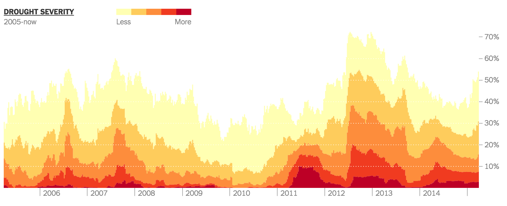
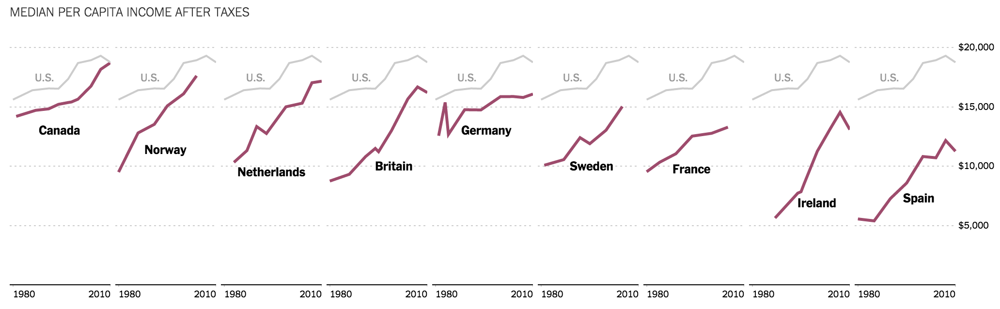

#Class 3: Developing a blueprint for fast prototyping; mastering chart components; abstracting simpler charts

Today we'll do much more technical work than we have in the past and try something out that lets you work on your own and solve your own problems for slightly longer bits of time.

"HARD" (more technical)
  - Develop a "starter kit" for starting charts quickly
  - Practice using a data join with different forms
  - Abstract basic charts using functions
  - Work with and style the D3 axis component 

 "SOFT" (less technical)
   - Practive intent
   - Consider execution challenges on small devices

##Housekeeping
Anythign to discuss? 

##Quick discussion
Last week this [Bloomberg piece](www.bloomberg.com/graphics/2015-whats-warming-the-world/) made the rounds. Let's take a look at both the mobile and desktop versions. Which is more effective at communicating its intent? Why?

##Quick activity
Charts are all about deciding what information you want to communicate to your readers. Let's discuss the goals of these ten charts and decide on a headline for each based on what we think the author is trying to communicate.

**[Droughts](http://www.nytimes.com/interactive/2014/upshot/mapping-the-spread-of-drought-across-the-us.html)**




**[Middle-class comparisons](http://www.nytimes.com/2014/04/23/upshot/the-american-middle-class-is-no-longer-the-worlds-richest.html)**



**[Related](http://www.nytimes.com/newsgraphics/2013/09/28/eli-manning-milestone/) [Quarterbacks](http://www.nytimes.com/interactive/2014/10/19/upshot/peyton-manning-breaks-touchdown-passing-record.html)**


<!-- **Grab bag**


 -->

##About data joins.
These [two](http://bost.ocks.org/mike/join/) [pieces](http://bost.ocks.org/mike/join/) discuss data joins in detail. We'll go over both, briefly, but for now, understanding Scott's is more important for near-term success. Questions?

##Lab, part 1
Last week we made a list of things we needed to do and wrote it down on the white board. You'll find yourself repeating this process a lot, so it's good to get used to developing it quickly. Broadly.

**General gameplan for sketching**

1. Navigate to your working directory, create an `index.html` file with D3 loaded and start a local server
1. Load your data
1. Add an SVG on the page.
1. Format your data, adding fields as necessary
1. Do your data join
1. Position your elements 
1. Add an axis
1. Add styles
1. Other customizations, "fiddly bits"

In detail:

1. **Navigate to your working directory of choice and fire up a local server**
  Make sure you're comfortable using the command line. There are [many ways](https://github.com/mbostock/d3/wiki#using) to set up a server.

1. **Loading data** Many data sets you'll be desiging for change – hourly, weekly, monthly, whatever. You don't want to be copy/pasting or doing manual labor every time your data set changes, so loading it exernally is a good idea. D3 comes with a [wide variety](https://github.com/mbostock/d3/wiki/Requests) of methods that let you load data asynchronously. We'll primarily use d3.tsv for "rectangular" data sets. This 

  ```
  d3.tsv("path/to/file.tsv", function(error, data) {
    if (error) return console.warn(error);

    //your code starts here

  });
  ```

  To clean things up, we can name the callback `ready` and define it below, but the difference is only cosmetic.

  ```
  d3.tsv("path/to/file.tsv", ready);

  function ready(error, data) {

    if (error) return console.warn(error);

    //your code starts here

  }

  ```

2. **Add an SVG on the page.**
  Most, but not all, of the time, you are going to be charting on an SVG element. There are all sorts of ways to do this, but [this bl.ock](http://bl.ocks.org/mbostock/3019563), which includes handy margin conventions is really useful, and my favorite. Key passage:

  ```
  var margin = {top: 20, right: 10, bottom: 20, left: 10};

  var width = 960 - margin.left - margin.right,
      height = 500 - margin.top - margin.bottom;

  var svg = d3.select("body").append("svg")
      .attr("width", width + margin.left + margin.right)
      .attr("height", height + margin.top + margin.bottom)
    .append("g")
      .attr("transform", "translate(" + margin.left + "," + margin.top + ")");
  ```

  Note a personal preference you're free to ignore: in the beginning, sometimes I like to make sure the SVG rendered without using the inspector, so I make a border around the SVG in CSS:

  ```
  <style type="text/css">
    svg {
      border: 1px solid #f0f;
    }
  </style>
  ```

4. **Format your data** 
  D3.tsv() Usually turns your data into strings, which makes doing math on them a bad idea. Or sometimes you just need to do light formatting, whether adding a leading zero to 4-digit FIPS codes or turning a string into a Date. Do this right when you load your data. 

  ```
  d3.tsv("path/to/file.tsv", ready);

  function ready(error, data) {

    if (error) return console.warn(error);

    //formatting numbers
    data.forEach(function(d) {
      d.x = +d.x;
      d.y = +d.y;
    });

  }

  ```


3. **Do your data join**
  Before you can style your elements or move them around your canvas, you need to create elements inside your SVG. Usually, this starts with a data join. If you're doing a data join with externally-loaded data, this join should happen inside your `ready` function. Note this pattern will not apply for every kind of data you chart, but it should do for the kinds of things we've worked with so far. Here, we add a `g` element for every row in our data.

  ```
  var margin = {top: 20, right: 10, bottom: 20, left: 10};

  var width = 960 - margin.left - margin.right,
      height = 500 - margin.top - margin.bottom;

  var svg = d3.select("body").append("svg")
      .attr("width", width + margin.left + margin.right)
      .attr("height", height + margin.top + margin.bottom)
    .append("g")
      .attr("transform", "translate(" + margin.left + "," + margin.top + ")");

  d3.tsv("path/to/file.tsv", ready);

  function ready(error, data) {
    if (error) return console.warn(error);

    svg.selectAll(".circle-group")
        .data(data)
        .enter()
        .append("g")
        .attr("class", "circle-group");
  }
  ```

4. **Position your elements** To do this, you need [scales](https://github.com/mbostock/d3/wiki/Scales), whether they’re linear, time, ordinal or something else. Note that when you’re making your scale dynamic –– to define its domain based on the data you load – you will have to define it in two steps: [range](https://github.com/mbostock/d3/wiki/Quantitative-Scales#linear_range) first, then [domain](https://github.com/mbostock/d3/wiki/Quantitative-Scales#linear_domain). Here, we define them above the `ready` function and update the domain for `xScale` and `yScale` only inside the `ready` function. (Why?)  

  ```
  var margin = {top: 20, right: 10, bottom: 20, left: 10};

  var width = 960 - margin.left - margin.right,
      height = 500 - margin.top - margin.bottom;

  var svg = d3.select("body").append("svg")
      .attr("width", width + margin.left + margin.right)
      .attr("height", height + margin.top + margin.bottom)
    .append("g")
      .attr("transform", "translate(" + margin.left + "," + margin.top + ")");

  var xScale = d3.scale.linear()
      .range([0,width]);

  // note our trick on yScale's range, since y=0 is at the top of the SVG 
  var yScale = d3.scale.linear()
      .range([height,0]);

  d3.tsv("path/to/file.tsv", ready);

  function ready(error, data) {
    if (error) return console.warn(error);

    //update domains based on extrema, which has pluses and minuses
    xScale.domain(d3.extent(data, function(d) { return d.xPos; }));
    yScale.domain(d3.extent(data, function(d) { return d.yPos; }));

    var circleGroup = svg.selectAll(".circle-group")
        .data(data)
      .enter()
        .append("g")
        .attr("class", "circle-group")
        .attr("transform", function(d) { return "translate(" + xScale(d.xPos) + "," + yScale(d.yPos) + ")"; });

    //since the gs are already positioned, we dont need to transform any of their child elements
    circleGroup.append("circle")
        .attr("r", 5);

    //move these just a touch
    circleGroup.append("text")
        .text(function(d) { return d.xPos + "," + d.yPos; })
        .attr("dx", 5)
        .attr("dy", -5);
  }
  ```

4. **Add an axis**
  D3 Axes are helpful, but they seem complicated sometimes. By calling an axis component, d3 will add a `g` element of class `tick` to your SVG. In each, it will add a `line` and `text`. You do this in two steps.

  First, declare the axes as variables.

  ```
  var xAxis = d3.svg.axis()
      .scale(xScale)
      .orient("bottom");

  var yAxis = d3.svg.axis()
      .scale(yScale)
      .orient("right");
  ```

  Then add `g` elements to your page and `call` the axes. Note the translation here.

  ```
  svg.append("g")
      .attr("class", "x axis")
      .attr("transform", "translate(0," + height + ")")
      .call(xAxis);

  svg.append("g")
      .attr("class", "y axis")
      .attr("transform", "translate(" + width + ",0)")
      .call(yAxis);
  ```

8. **Add styles** and customize as necessary
  You'll definitely need to style your axes at the very least, but probably more too.

9. **Example: putting it all together.** 
  Also captured here as [a bl.ock](http://bl.ocks.org/kpq/4ec215b40c1d559fcb2a)

  ```
  <!DOCTYPE html>
  <meta charset="utf-8">

  <style type="text/css">

    body {
      font-family: arial, sans;
      font-size: 11px;
    }
    
    svg {
      border: 1px solid #f0f;
    }

    .axis line,
    .axis path {
      fill: none;
      stroke: #000;
      shape-rendering: crispEdges;
    }

  </style>

  <body>

  </body>

  <script src="https://cdnjs.cloudflare.com/ajax/libs/d3/3.5.5/d3.min.js" charset="utf-8"></script>

  <script type="text/javascript">
    
  var margin = {top: 20, right: 50, bottom: 20, left: 10};

  var width = 960 - margin.left - margin.right,
      height = 500 - margin.top - margin.bottom;

  var svg = d3.select("body").append("svg")
      .attr("width", width + margin.left + margin.right)
      .attr("height", height + margin.top + margin.bottom)
    .append("g")
      .attr("transform", "translate(" + margin.left + "," + margin.top + ")");

  var xScale = d3.scale.linear()
      .range([0,width]);

  var yScale = d3.scale.linear()
      .range([height,0]);

  var xAxis = d3.svg.axis()
      .scale(xScale)
      .orient("bottom");

  var yAxis = d3.svg.axis()
      .scale(yScale)
      .orient("right");

  d3.tsv("quartet.tsv", ready);

  function ready(error, data) {
    if (error) return console.warn(error);

    data.forEach(function(d) {
      d.xPos = +d.xPos;
      d.yPos = +d.yPos;
    });

    //update domains based on extrema, which has pluses and minuses
    xScale.domain(d3.extent(data, function(d) { return d.xPos; }));
    yScale.domain(d3.extent(data, function(d) { return d.yPos; }));

    svg.append("g")
        .attr("class", "x axis")
        .attr("transform", "translate(0," + height + ")")
        .call(xAxis);

    svg.append("g")
        .attr("class", "y axis")
        .attr("transform", "translate(" + width + ",0)")
        .call(yAxis);

    var circleGroup = svg.selectAll(".circle-group")
        .data(data)
      .enter()
        .append("g")
        .attr("class", "circle-group")
        .attr("transform", function(d) { return "translate(" + xScale(d.xPos) + "," + yScale(d.yPos) + ")"; });

    circleGroup.append("circle")
        .attr("r", 5);

    circleGroup.append("text")
        .text(function(d) { return d.xPos + "," + d.yPos; })
        .attr("dx", 5)
        .attr("dy", -5);

      }
  </script>
  ```

##Goal
Continue last week's bar chart using these steps if you need help. Try to make it look like this. Use the checklist as a guide for yourself, and to find friends who are stuck on the same step as you.


##For overachievers

Those of you in Skittles groups 1, 2 and 3 may consider yourselves Republican chartmakers; those of you in groups 4 and 5 are Democratic chartmakers.

Late in the 2012 Presidential election, both parties tried to "spin" the jobs report to match their campaigns. Democrats focused on private-sector growth (`private_job_growth` in our tsv), emphasizing that it had been positive for 31 consecutive months. 

Republicans noted that just to keep pace with population growth, the economy would need to add 150,000 jobs per month just to keep pace. Keeping that in mind, they considered job growth weak.

Your job is to make the chart that best makes your case for your opinion of the jobs report. Most of the technical framework is here already; most of your work will be deciding what to show and how to show it.

Ideally, publish your chart as a bl.ock and share it in our Slack channel. Feel free to ask each other for tips and feedback throughout the process.

I'll happily give advice to anyone who asks for it and has a link to share. Ideally, you post yours over the weekend, but you're the boss.


