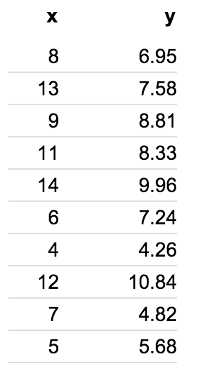
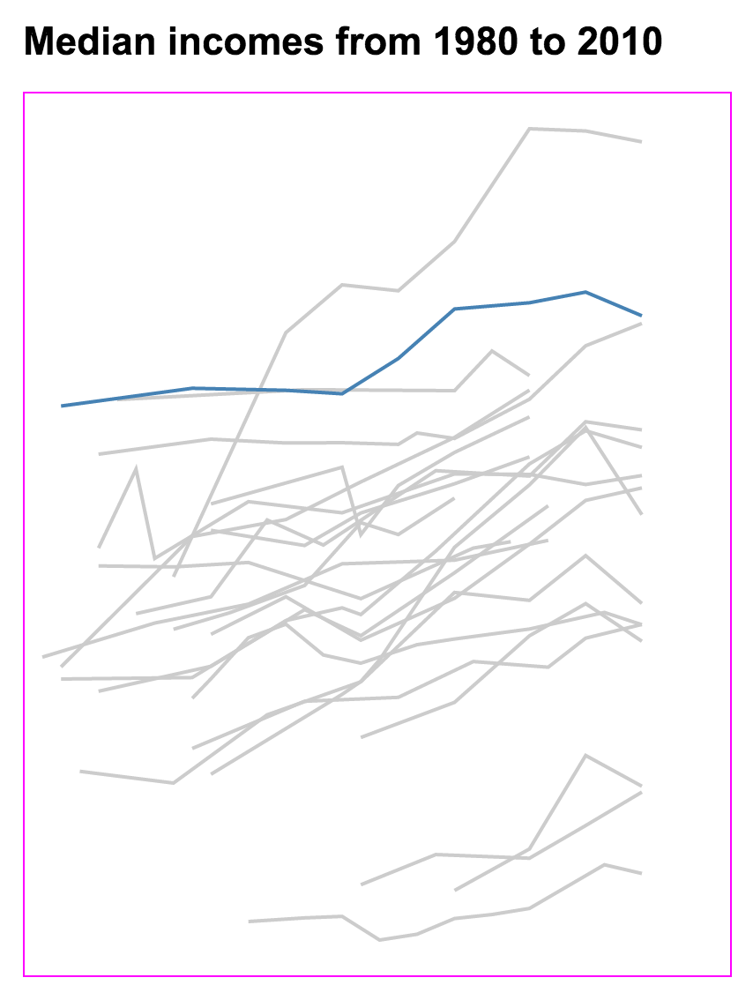
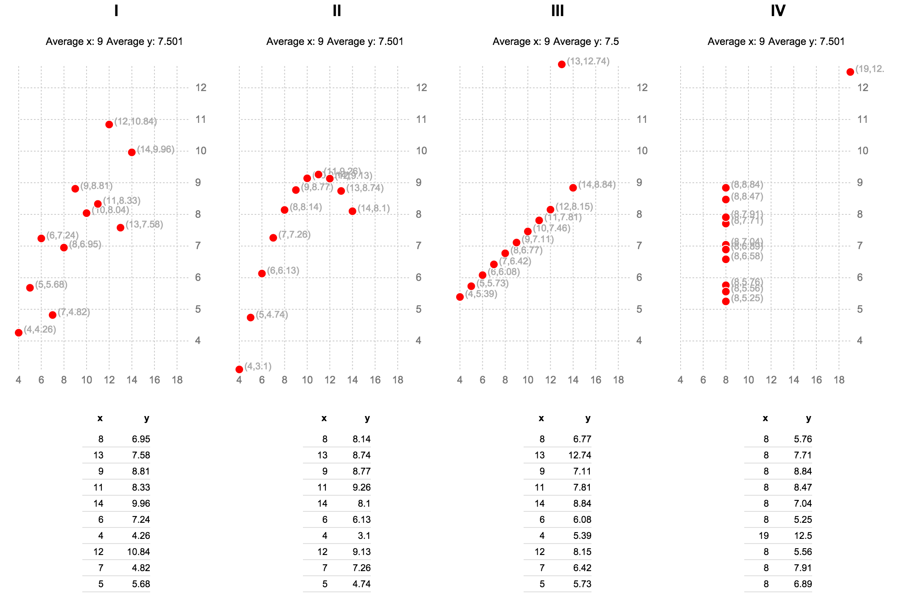

#Class 6: Reviewing the Fundamentals So Far; Working more with d3.nest() 

##Housekeeping
  * Google survey

##Lab, part I: Reviewing the basics
This week we've started to get deeper into more complex and abstract techniques, both with D3, like d3.nest(), and more basic Javascript, like abstracting code using functions or more complex data operations. Those are important, but ultimately useless unless you have a strong foundation in the core principles of D3 and its main components and methods.

Today we'll do a primer of sorts on what we've learned so far with a series of "stations". In each one, I'll give you some small bit of code and ask you to complete a small task. This should help you identify what you're strongest and weakest in. Most of the data we will have worked with before.

Once we're done, we'll have volunteers from the class explain how they did each one.

**Station 1: Loading and formatting data** Load [jobs.tsv](jobs.tsv) in an HTML page. Format the numbers to be numbers and add a new field called `properDate` that's a Javascript Date object. The MDN [Date docs](https://developer.mozilla.org/en-US/docs/Web/JavaScript/Reference/Global_Objects/Date) might help; same with the basic [String](https://developer.mozilla.org/en-US/docs/Web/JavaScript/Reference/Global_Objects/String) docs.

**Station 2: A data join** Data joins are useful for any data-driven document; not just charts in SVG. Load the first group of Anscombe's quartet [group1.tsv](group1.tsv) and create an HTML table in Javascript using D3. It wouldn't be the worst if it looked like this:



**Station 3: Creating an x and y scale** Here, given code that already loads and formats data and has an SVG on the page, create xScale and yScale variables and use them to position elements on a page. We'll use the same first group of Anscombe's quartet ([group1.tsv](group1.tsv)) for this one. It's already been started for you:

```
<script src="https://cdnjs.cloudflare.com/ajax/libs/d3/3.5.5/d3.min.js" charset="utf-8"></script>


<style type="text/css">
  /*css to go here*/

  body {
    font-family: arial, sans;
    width: 720px;
    margin: 20px auto;
  }

  svg {
    border:1px solid #f0f;
  }

  .anscombe-circle-group text {
    fill: #aaa;
    font-size: 11px;
  }

  .anscombe-circle-group circle {
    fill: red;
    stroke: #fff;
    stroke-width:1px;

  }

</style>

<body>

</body>


<script>

// TODO: add xScale and yScale variables with domains and ranges,
// then position your circles accordingly.

var margin = {top: 20, right: 40, bottom: 20, left: 10};

var width = 720 - margin.left - margin.right,
    height = 400 - margin.top - margin.bottom;

var svg = d3.select("body").append("svg")
    .attr("width", width + margin.left + margin.right)
    .attr("height", height + margin.top + margin.bottom)
  .append("g")
    .attr("transform", "translate(" + margin.left + "," + margin.top + ")");

d3.tsv("group1.tsv", ready);

function ready(error, data) {
  if (error) return console.warn(error);

  data.forEach(function(d) {
    d.x = +d.x;
    d.y = +d.y;
  });

  //here is your data join.
  var circleGroup = svg.selectAll(".anscombe-circle-group")
      .data(data)
    .enter()
      .append("g")
      .attr("class", "anscombe-circle-group");
      //you need to translate these gs using your scale!

  circleGroup.append("circle")
      .attr("r", 5);

  circleGroup.append("text")
      .text(function(d) { return "(" + d.x + "," + d.y + ")"; })
      .attr("dx", 6);
}


</script>
```

**Station 4: Adding and styling axes to an existing plot** Here, we've already got a chart plotted for you; all that's missing is an `xAxis` and `yAxis`. The chart is the median incomes of about 10 countries over time. The data is called [all-countries.tsv](all-countries.tsv). It looks like this:



Here's the code you should start with:

```
<!DOCTYPE html>
<meta charset="utf-8">

<style type="text/css">

  body {
    font-family: arial, sans;
    font-size: 11px;
    width:400px;
    margin: 40px auto;
  }
  
  svg {
    border: 1px solid #f0f;
  }

  .axis line,
  .axis path {
    fill: none;
    stroke: #000;
    shape-rendering: crispEdges;
  }

  .g-country-line {
    stroke: #ccc;
    fill:none;
    stroke-width: 2px;
  }

  .g-country-line.g-usa-line {
    stroke: steelblue;
  }

  .g-country-line.g-secondary-line {
    stroke: #f0f0f0;
  }

  .country-container {
    display: inline-block;
  }

</style>

<body>
<h1>Median incomes from 1980 to 2010</h1>
</body>

<script src="https://cdnjs.cloudflare.com/ajax/libs/d3/3.5.5/d3.min.js" charset="utf-8"></script>

<script type="text/javascript">
  
var margin = {top: 20, right: 50, bottom: 20, left: 10};

var width = 400 - margin.left - margin.right,
    height = 500 - margin.top - margin.bottom;


var xScale = d3.scale.linear()
    .range([0,width]);

var yScale = d3.scale.linear()
    .range([height,0]);

var line = d3.svg.line()
      .x(function(d) { return xScale(d.year); })
      .y(function(d) { return yScale(d.cop50); });

var svg = d3.select("body").append("svg")
    .attr("width", width + margin.left + margin.right)
    .attr("height", height + margin.top + margin.bottom)
  .append("g")
    .attr("transform", "translate(" + margin.left + "," + margin.top + ")");

d3.tsv("all-countries.tsv", ready);

function ready(error, data) {
  if (error) return console.warn(error);

  console.log(data);

  data.forEach(function(d) {

    //remove all numbers
    d.country = d.dataset.replace(/\d/g,'').split(" - ")[1].trim();

    //remove all non-numbers
    d.year = +d.dataset.replace(/\D/g,'');

    //make cop50 a number
    d.cop50 = +d.cop50.replace(",", "");
  });


  //update domains based on extrema, which has pluses and minuses
  xScale.domain(d3.extent(data, function(d) { return d.year; }));
  yScale.domain(d3.extent(data, function(d) { return d.cop50; }));

  var incomeByCountry = d3.nest()
      .key(function(d) { return d.country; })
      .entries(data);

  var countryGroup = svg.selectAll(".g-country-group")
      .data(incomeByCountry)
      .enter()
      .append("g")
      .attr("class", "g-country-group");

  countryGroup.append("path")
      .attr("class", function(d) { return "g-country-line " + (d.key === "United States" ? "g-usa-line" : "") ;})
      .attr("d", function(d) { return line(d.values); });

}


</script>
```

##Lab part II: Working more with D3.nest()
On Tuesday we started using a very powerful data manupulation tool. Today we'll keep going.

Our goal: to create this:



